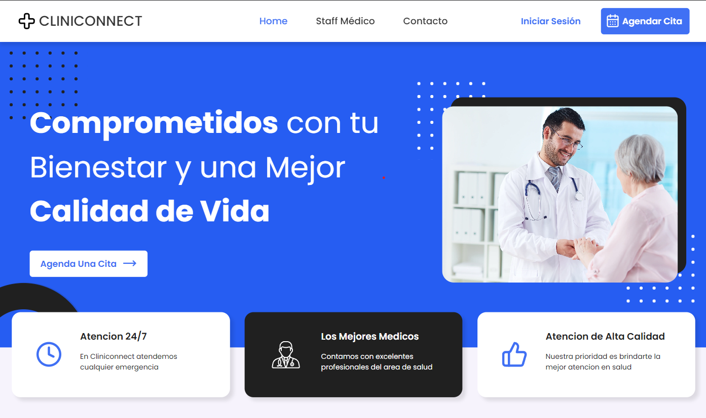

# Cohorte 14 - Equipo 18 - Full time - Nodejs - React.

Realizamos un proyecto sobre la pagina web de una clinica en Buenos Aires, con el objetivo de faciliar los pasos para sacar un turno y ser atendido en un hospital, con esta aplicación el cliente puede registrarse con su DNI(documento unico de identidad), y una vez logeado tendra información sobre todos los medicos que hay disponibles y las sedes donde ofrecen sus servicios.

Ademas de agendar el turno, la aplicación te enviara un mail donde te dara la información del dia y la hora que deberas concurrir al centro de salud.

## LINKS DE DEPLOY 🌐

- FRONTEND: [https://c14-18-ft-node-react.vercel.app/](https://c14-18-ft-node-react.vercel.app/)
- BACKEND: [https://c14-18-ft-node-react-production.up.railway.app/](https://c14-18-ft-node-react-production.up.railway.app/)

## Tecnologias utilizadas 🛠️

### FRONT END

* HTML.
* CSS.
* JavaScript.
* Next.js
* SweetAlert
* Sonner

### BACK END

* Node.js
* Express.js
* Mysql2
* bcrypt
* jwt
* Nodemailer
* sequelize

## INTEGRANTES 💻

| |  |
|:-:|:-:|
| **Alvaro Rodriguez**| **Eduardo Tolaba**|
|   |  </a> 
